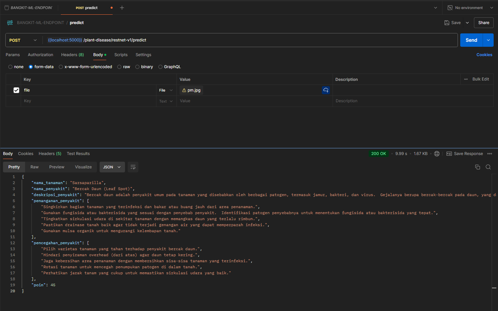

# Plant Disease Detection API

This project is a Flask-based REST API designed to predict plant diseases using a ResNet50 model. Users can upload an image of a plant, and the API will provide information about the plant disease, including its name, description, prevention methods, and a severity score.


## Folder Structure

```
pd-restapi
├── .env
├── .env.example
├── .gitignore
├── app.py                 # Main application file
├── components
│   ├── llm.py             # Language model utility
│   └── parser.py          # Data parsing utility
├── models
│   └── resnet50_aug.h5    # Pre-trained model for prediction
├── others
│   └── api
│       └── plantName.py   # Utility for plant name prediction
├── predict.py             # Prediction logic
├── requirements.txt       # Python dependencies
├── static
│   └── uploads            # Directory for uploaded images
│       ├── sample images
└── utils
    └── response.py        # Response formatting utility

```

---

## Installation

### Prerequisites

- Python 3.10+
- Pip (Python package manager)

### Steps

1. Clone the repository:

```bash
git clone https://github.com/Idoo0/YukTanam-ml-api
cd YukTanam-ml-api
```

2. Install dependencies:

```bash
pip install -r requirements.txt
```

3. Place the model file in the `models` folder:

Ensure `resnet50_aug.h5` or other models is in the `models` directory.

4. Create `.env` file:

```bash
cp .env.example .env
```

5. Update `.env` with necessary configurations.

---

## Usage

1. Start the server:

```bash
python app.py
```

2. Access the API endpoint for predictions:

### Endpoint:

`POST /plant-disease/restnet-v1/predict`

### Payload:

Upload an image file with the key `file`.

### Response Example:

```json
{
  "nama_tanaman": "Tomato",
  "nama_penyakit": "Early Blight",
  "deskripsi_penyakit": "A fungal disease affecting the foliage, stem, and fruit.",
  "penanganan_penyakit": "Remove infected leaves, apply fungicide.",
  "pencegahan_penyakit": "Avoid overhead watering, plant resistant varieties.",
  "poin": 45
}
```

3. View the predictions directly in JSON format.

---

## Postman Guide
Example for access api from postman:



## Troubleshooting

- Ensure the required Python dependencies are installed.
- Check the `models` directory for the `resnet50_aug.h5` model.
- Verify Flask and TensorFlow are compatible with your Python version.

---

## Contributing

Feel free to fork this project, create a feature branch, and submit a pull request.

---


## License

This project is licensed under the MIT License.
